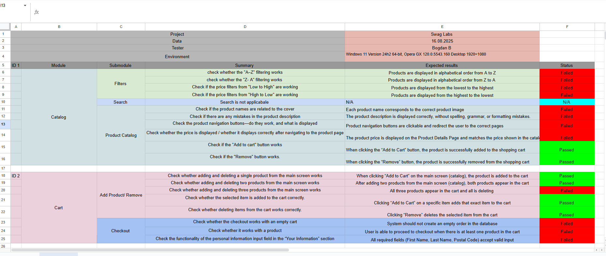

# 🧪 Swag Labs – QA Checklist

**Author:** Bogdan  
**Company:** SoftServe Academy (Practice)  
**Project:** Swag Labs – Demo e-commerce  
**Date:** 2025-08-16  

---

## 📑 Checklist Versions

- [📂 Excel version (with colors)](SwagLabs_Checklist_Full.xlsx)  
- [📄 Markdown version](SwagLabs_Checklist.md)  
- 🖼️ Screenshot preview (from Google Sheets):  

---

## 🧪 About this Project
This repository contains my **first QA checklist**, created as practice for testing the demo e-commerce site **Swag Labs**.  
The checklist covers the main modules of the application:

- **Catalog** (sorting, product details, add/remove buttons)  
- **Cart** (adding/removing products, cart counter)  
- **Checkout** (information input, validation, order flow)  

Both **positive** and **negative** test scenarios are included.

---

## 🎯 My Goal
To build a portfolio as an aspiring **Junior QA Engineer** and continue practicing on real demo projects.  
This repository is part of my learning journey into QA.

